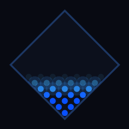

# Fluid LED Grid

傾きに応じて流体が動く 20×20 LED グリッドシミュレーション。  
Qt6/C++ 製。Android（加速度センサー）と Windows（マウス操作）で動作します。



## 機能

- **粒子ベースの流体シミュレーション** — 30% 充填、壁反射・粒子間反発
- **傾き検知** — Android: 加速度センサー / PC: マウス移動で重力方向をシミュレート
- **設定パネル**（⚙ ボタンから開く）
  - センサー感度（0.2x〜3.0x）
  - 粘度（水〜ハチミツ）
  - カラー選択（プリセット5色 + 色相スライダー）
  - リセット（粒子を下部に再配置）
- 設定は終了後も保存（`QSettings`）

## スクリーンショット

| PC（マウス操作） | Android |
|---|---|
| マウスを素早く振るとスプラッシュ | 端末を傾けると流体が移動 |

## 動作環境

| 項目 | バージョン |
|------|-----------|
| Qt | 6.4 以上 |
| Android NDK | 27.2 |
| Android SDK | API 28〜36 |
| JDK（Android ビルド） | 17 |
| CMake | 3.21 以上 |

## ビルド手順

### Windows（デスクトップ）

```bash
cmake -B build -DCMAKE_PREFIX_PATH=/path/to/Qt/6.x.x/msvc2022_64
cmake --build build
```

### Android

```bash
cmake -B build-android \
  -DCMAKE_TOOLCHAIN_FILE=$ANDROID_NDK/build/cmake/android.toolchain.cmake \
  -DANDROID_ABI=arm64-v8a \
  -DANDROID_NDK=$ANDROID_NDK \
  -DANDROID_SDK_ROOT=$ANDROID_SDK_ROOT \
  -DCMAKE_PREFIX_PATH=/path/to/Qt/6.x.x/android_arm64_v8a \
  -DQT_HOST_PATH=/path/to/Qt/6.x.x/mingw_64 \
  -DCMAKE_BUILD_TYPE=Debug

cmake --build build-android --target apk
```

Qt Creator を使う場合は `Android arm64-v8a` キットを選択するだけです。

### リリース署名

プロジェクトルートに `android-signing.properties` を作成します（`.gitignore` 済み）。

```properties
storeFile=/path/to/your.jks
storePassword=yourpassword
keyAlias=youralias
keyPassword=yourpassword
```

環境変数でも指定できます。

```bash
export ANDROID_storeFile=/path/to/your.jks
export ANDROID_storePassword=yourpassword
export ANDROID_keyAlias=youralias
export ANDROID_keyPassword=yourpassword
```

## PC での操作方法

マウスを動かすと重力方向が変わります。

| 操作 | 効果 |
|------|------|
| ゆっくり移動 | 静かに傾く |
| 素早く振る | 衝撃が加わりスプラッシュ |
| 右下の ⚙ | 設定パネルを開く |

## ライセンス

MIT
